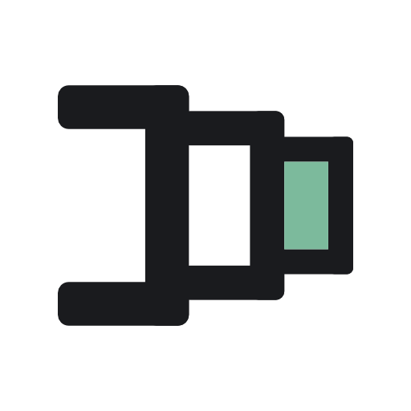
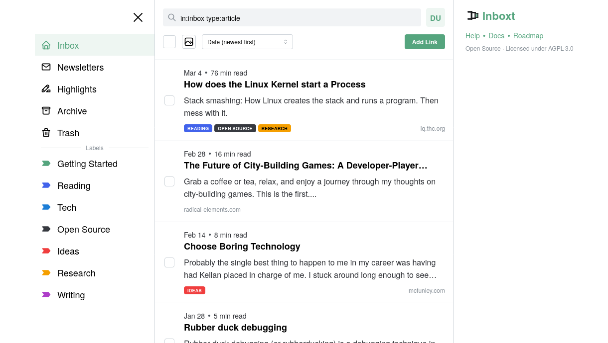

# Inboxt

<p align="center">
  
</p>

<p align="center">
  <a href="https://github.com/Inboxt/inboxt/actions/workflows/build-and-push.yml"></a>
  <a href="https://github.com/Inboxt/inboxt/tags"></a>
  <a href="https://github.com/Inboxt/inboxt/pkgs/container/inboxt"></a>
</p>

Inboxt is a self-hostable read-later app for articles and newsletters.
Save what matters and read on your own time. Keep full control of your data. No algorithms. No ads. No tracking.

[Landing Page](https://inboxt.app) • [Documentation](https://docs.inboxt.app) • [Self-Hosting Guide](https://docs.inboxt.app/self-hosting) • [Contributing](https://docs.inboxt.app/contributing)

## Key Features

- **Reader View:** A clean, focused interface for reading saved content.
- **Newsletter Support:** Receive newsletters directly into your Inboxt via a unique inbound email address.
- **Organization:** Use labels, archiving, and full-text search to manage your library.
- **Privacy First:** Self-hosted, open-source, and no tracking.
- **Import/Export:** Easily move your data in and out.
- **Browser Extension:** One-click saving from your browser.
- **PWA Support:** Installable on mobile and desktop for an app-like experience.

<picture>
  <source media="(prefers-color-scheme: dark)" srcset="./app-dark.png">
  
</picture>

## Tech Stack

Inboxt is a modern monorepo built for speed and type safety using **React**, **Vite**, **Mantine**, and **TanStack Router** on the frontend, with a **NestJS** backend powered by **PostgreSQL**, **Valkey** (Redis), **Prisma**, and **GraphQL**. Background jobs are handled by **BullMQ**, and the browser extension is built with **WXT**.

## Repository Structure

- `apps/api`: NestJS backend.
- `apps/web`: React frontend.
- `apps/web-extension`: Browser extension.
- `libs/common`: Shared types and logic.
- `libs/ui`: Shared UI components.

## Getting Started

### 🚀 Quick Start (Self-Hosting)

The recommended way to run Inboxt is using Docker Compose.

```bash
# 1. Prepare environment
cp self-hosting.env.example .env

# 2. Start Inboxt
docker compose up -d
```

For detailed configuration (SSL, reverse proxy, etc.), please follow our **[Self-hosting Guide](https://docs.inboxt.app/self-hosting)**.

### 🛠 Local Development

To set up a local development environment (Web in Vite locally; DB, API, Mailpit in Docker):

```bash
# 1. Clone the repository
git clone https://github.com/Inboxt/inboxt.git
cd inboxt

# 2. Setup environment
cp dev.env.example .env

# 3. Install dependencies
npm install

# 4. Start infrastructure and Web app
npm run dev
```

For more in-depth setup information, see our **[Local Development Guide](https://docs.inboxt.app/local-development)**.

## Discussions & Issues

Have a question or a suggestion? Feel free to open a [GitHub Discussion](https://github.com/Inboxt/inboxt/discussions) or [report an issue](https://github.com/Inboxt/inboxt/issues). For more information on how to contribute, please refer to our **[Contributing Guide](https://docs.inboxt.app/contributing)**.

## Security

Looking to report a vulnerability? Please refer to our **[SECURITY.md](./SECURITY.md)** file.

## License

This project is licensed under the **AGPL-3.0**.

Third-party clients, integrations, and extensions that communicate with the server exclusively via the public API are not considered derivative works.

